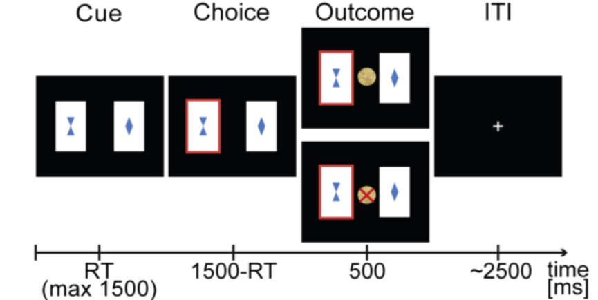

```{r setup, include=F}
knitr::opts_chunk$set(echo = TRUE)
```

```{r, include=F}
rm(list = ls()) 

if (!require(ggplot2)) install.packages("ggplot2")
if (!require(readxl)) install.packages("readxl")
if (!require(tidyverse)) install.packages("tidyverse")
if (!require(psych)) install.packages("psych")
if (!require(car)) install.packages("car")
if (!require(lme4)) install.packages("lme4")
if (!require(ez)) install.packages("ez")
if (!require(broom)) install.packages("broom")
if (!require(strex)) install.packages("strex")
if (!require(nlme)) install.packages("nlme")
if (!require(lattice)) install.packages("lattice")
if (!require(tinytex)) install.packages('tinytex')
if (!require(purrr)) install.packages('purrr')
if (!require(knitr)) install.packages("knitr")
if (!require(kableExtra)) install.packages('kableExtra')
if (!require(stringr)) install.packages('stringr')
if (!require(hypr)) install.packages('hypr')
if (!require(schoRsch)) install.packages('schoRsch')
if (!require(hrbrthemes)) install.packages('hrbrthemes')
if (!require(emmeans)) install.packages('emmeans')
if (!require(psycho)) install.packages('psycho')
if (!require(gghalves)) install.packages('gghalves')
if (!require(sjPlot)) install.packages('sjPlot')
if (!require(sjmisc)) install.packages('sjmisc')
if (!require(effects)) install.packages('effects')
if (!require(sjstats)) install.packages('sjstats')
if (!require(cowplot)) install.packages('cowplot')
if (!require(ggpubr)) install.packages('ggpubr')
if (!require(foreign)) install.packages('foreign')

library("ggplot2")
library("readxl")
library("tidyverse")
library("psych")
library("car")
library("lme4")
library("ez")
library("broom")
library("strex")
library("nlme")
library("lattice")
library("tinytex")
library("purrr")
library("knitr")
library("kableExtra")
library("stringr")
library("hypr")
library('schoRsch')
library('hrbrthemes')
library('emmeans')
library('psycho')
library('gghalves')
library('sjPlot') #for plotting lmer and glmer mods
library('sjmisc') 
library('effects')
library('sjstats') #use for r2 functions
library('cowplot')
library("ggpubr")
library("foreign")

```

```{r, include=FALSE}
## NECESSARY TO RUN THIS FIRST
source('preps/data_import.R')

```

```{r, include=FALSE}
## NECESSARY TO RUN THIS FIRST
source('preps/prep_agg.R')

```

```{r, include=FALSE}
## NECESSARY TO RUN THIS FOR LATER RMANOVA ANALYSES (all markdowns in analyses folder)
source('preps/longtowide_agg.R')

```

```{r, include=FALSE}
## NECESSARY TO RUN THIS FIRST
source('preps/cort_import.R')

```

```{r, include=FALSE}
## NECESSARY TO RUN THIS FIRST
source("preps/import_singletrial_data.R")
```

## Methods

### Study Design

The study entailed a within-subjects design, in which participants performed the reversal learning task in two separate test sessions seven days apart. 

### Task Design

Participants performed a probabilistic reversal learning task, which included 160 trials and comprised around 12 minutes. The task was programmed in Matlab (The MathWorks, Natick, MA) with Psychtoolbox. On every trial, participants had to decide between two cards, depicting a different geometric stimulus. The underlying reward structure was not explicitly instructed but could be inferred: reward probabilites associated with the two choice options were anticorrelated (i.e. whenever card A was rewarded, card B was a loss and vice versa). Furthermore, Participants were informed on the probabilistic nature of the task: the respective winning card was only rewarded in 80% of all trials. Right-side versus left-side location of the stimulus was randomized [@Reiter2016].

#### Exemplary Reversal Learning Task


```{r fig1, echo = FALSE, out.width = "40%", fig.cap = "Adapted from Reiter (2016) (original [here](https://www.ncbi.nlm.nih.gov/pmc/articles/PMC6705653/))"}





```


```{r task structure, include=T, echo = F}
# Task Structure

state_rev <- c(1,	1,	1,	1,	1,	1,	1,	1,	1,	1,	1,	1,	1,	1,	1,	1,	1,	1,	1,	1,	1,	1,	1,	1,	1,	1,	1,	1,	1,	1,	1,	1,	1,	1,	1,	1,	1,	1,	1,	1,	1,	1,	1, 1,	1,	1,	1,	1,	1,	1,	1,	1,	1,	1,	1,	2,	2,	2,	2,	2,	2,	2,	2,	2,	2,	2,	2,	2,	2,	2,	1,	1,	1,	1,	1,	1,	1,	1,	1,	1,	1,	1,	1,	1,	1,	1,	1,	1,	1,	1,	2,	2,	2,	2,	2,	2,	2,	2,	2,	2,	2,	2,	2,	2,	2,	1,	1,	1,	1,	1,	1,	1,	1,	1,	1,	1,	1,	1,	1,	1,	1,	1,	1,	1,	1,	2,	2,	2,	2,	2,	2,	2,	2,	2,	2, 2,	2,	2,	2,	2,	2,	2,	2,	2,	2,	2,	2,	2,	2,	2,	2,	2,	2,	2,	2,	2,	2,	2,	2,	2,	2)

state_rev_2 <- replace(state_rev, state_rev==2, 0)

plot(state_rev_2,type = "o", col = "black", xlab = "Trial", ylab = "Outcome probability", main = "Contingencies")


```

### Physiological stress response

Saliva was collected using Salivette saliva sampling tubes (SalivetteCortisol®, Sarstedt, Nuembrecht, Germany) to extract and measure salivary cortisol. Physiologically relevant cortisol increases were defined at a threshold of 1.5nmol per liter (nmol/l) increase post-stress (t3 through t6) above the lowest pre-stress level (t1 or t2) during the stress condition as described previously [@Radenbach2015]. Individual cortisol reactivity was determined by calculating the area under the curve with respect to ground (AUCg-stress and AUCg-control, according to Pruessner et al., 2003) separately for both conditions and subtracting AUCg-control from AUCg-stress. 

### Behavioral Analyses

The statistical software R (version 3.6.3; R Foundation for Statistical Computing, Vienna, Austria) with the lme4 package (@Bates2015) for generalized linear mixed-effects models [@Bates2015] was used. Task phase, condition day (CT/ST) and cortisol were modeled as fixed effects, subjects with a random intercept and outcome variables of correct performance, win-stay behavior, lose-switch-behavior and reaction times.

## Results


### Stress Induction


```{r, include=T,message=FALSE, echo=F, results = 'hide',error=FALSE,warning=FALSE}
#[(beta=``r mod1.HC.correct@beta[1]`).``r resul$lower.random``; ``r resul$upper.random``], z=``r resul$zval.random``, p=``r resul$pval.random``, see Figure x). 
longdat.correct$jvolat2 <- jitter(longdat.correct$volat2, amount=.09)
longdat.HC.correct$jvolat2 <- jitter(longdat.HC.correct$volat2, amount=.09)
longdat.AD.correct$jvolat2 <- jitter(longdat.AD.correct$volat2, amount=.09)

f3_pcorrect_HC <- ggplot(data=longdat.HC.correct, aes(y=p_correct)) +
  
   #Add geom_() objects
   geom_point(data = longdat.HC.correct %>% filter(cond2=="1"), aes(x=jvolat2), color = '#00BFC4', size = 1.5, 
              alpha = .6) +
      geom_point(data = longdat.HC.correct %>% filter(cond2=="0"), aes(x=jvolat2), color = '#F8766D', size = 1.5,
              alpha = .6) +

   geom_line(aes(x=jvolat2, group=sub_id), color = 'lightgray', alpha = .3) +
    
        geom_half_boxplot(
     data = longdat.HC.correct %>% filter(volat1=="pre_ST"), aes(x=jvolat2, y=p_correct), position = position_nudge(x = -.3),
     side = "r",outlier.shape = NA, center = TRUE, errorbar.draw = FALSE, width = .2, 
     fill = '#F8766D') +

      geom_half_boxplot(
     data = longdat.HC.correct %>% filter(volat1=="rev_ST"), aes(x=jvolat2, y=p_correct), position = position_nudge(x = -.3),
     side = "r",outlier.shape = NA, center = TRUE, errorbar.draw = FALSE, width = .2, 
     fill = '#F8766D') +

      geom_half_boxplot(
     data = longdat.HC.correct %>% filter(volat1=="post_ST"), aes(x=jvolat2, y=p_correct), position = position_nudge(x = -.3),
     side = "r",outlier.shape = NA, center = TRUE, errorbar.draw = FALSE, width = .2, 
     fill = '#F8766D') +
      
     geom_half_boxplot(
     data = longdat.HC.correct %>% filter(volat1=="pre_CT"), aes(x=jvolat2, y=p_correct), position = position_nudge(x = -.3),
     side = "r",outlier.shape = NA, center = TRUE, errorbar.draw = FALSE, width = .2, 
     fill = '#00BFC4') +

      geom_half_boxplot(
     data = longdat.HC.correct %>% filter(volat1=="rev_CT"), aes(x=jvolat2, y=p_correct), position = position_nudge(x = -.3),
     side = "r",outlier.shape = NA, center = TRUE, errorbar.draw = FALSE, width = .2, 
     fill = '#00BFC4') +

      geom_half_boxplot(
     data = longdat.HC.correct %>% filter(volat1=="post_CT"), aes(x=jvolat2, y=p_correct), position = position_nudge(x = -.3),
     side = "r",outlier.shape = NA, center = TRUE, errorbar.draw = FALSE, width = .2, 
     fill = '#00BFC4') +
   #Define additional settings
   scale_x_continuous(breaks=c(1,2,3,4,5,6), labels=c("Stress_pre", "Stress_rev", "Stress_post","Control_pre","Control_rev","Control_post")) +
   xlab("Condition") + ylab("Percentage of correct responses") +
   labs(title = 'Expected task effect: performance decreased in reversal phase', 
           subtitle = 'Condition by phase',
           caption = 'Datapoints are jittered') + 
   theme(plot.title = element_text(face = "italic"))
   theme_classic()
   
f3_pcorrect_HC

```


### References